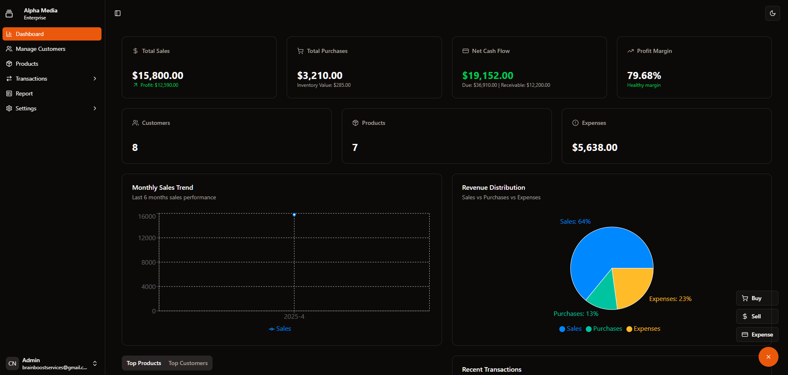

# IPTV Business Management System



## 📺 Overview

A comprehensive web application for IPTV business management, accounting, and customer relationship management. This system helps IPTV service providers track finances, manage subscriptions, handle transactions, and communicate with customers through integrated SMS notifications.

## Backend Repo: [https://github.com/CodeBuddy07/accounting-server-site](https://github.com/CodeBuddy07/accounting-server-site)


## 💼 Key Features

- **Financial Management**: Track revenue, expenses, and profit margins
- **Transaction Processing**: Record and manage all customer transactions
- **Customer Management**: Maintain customer profiles and subscription details
- **Automated Notifications**: Send SMS alerts for payment reminders and invoices
- **Financial Reports**: Generate detailed financial reports and analytics
- **User Authentication**: Role-based access control administrator
- **Responsive Dashboard**: Real-time metrics and business insights
- **Dark/Light Mode**: User-friendly interface with theme options

## 🛠️ Technology Stack

- **Frontend**: React 19 with React Router DOM
- **UI Components**: Radix UI component library
- **Styling**: Tailwind CSS with custom animations
- **State Management**: React Query for server state
- **Form Handling**: React Hook Form
- **HTTP Requests**: Axios
- **Data Visualization**: Recharts for financial reports and analytics
- **Date Handling**: date-fns
- **Notifications**: Sonner for toast notifications
- **Local Storage**: localforage for client-side data persistence
- **Theme Management**: next-themes for dark/light mode

## 📋 Prerequisites

- Node.js 18.x or later
- npm or yarn
- SMS Gateway API credentials for production deployment

## 🚀 Getting Started

1. **Clone the repository**

```bash
git clone https://github.com/CodeBuddy07/accounting-client-site.git
cd accounting-client-site
```

2. **Install dependencies**

```bash
npm install
# or
yarn install
```

> ⚠️ **Note**: SMS functionality only works in production with valid API keys.

3. **Start the development server**

```bash
npm run dev
# or
yarn dev
```

4. **Open your browser**

Navigate to [http://localhost:5173](http://localhost:5173) to see the application.


## 💰 Financial Management

The system provides comprehensive financial management tools:

- Transaction recording and categorization
- Revenue tracking by service type, duration, and customer segment
- Expense management
- Profit/loss reporting
- Financial dashboard with key performance indicators

## 👥 Customer Management

Keep track of all customer information:

- Customer profiles with contact details
- Payment records
- Communication logs
- Service preferences
- Custom notes

## 📱 SMS Notification System

The integrated SMS notification system allows you to:

- Send payment reminders
- Notify customers about subscription expiration
- Confirm successful payments
- Alert customers about service updates
- Send promotional messages

> ⚠️ **Note**: SMS functionality requires valid API credentials and only works in production environment.


## 🔐 Security Features

- JWT authentication
- Role-based access control
- Encrypted data storage
- Secure API communication
- Session management
- Activity logging

## 🚢 Deployment

### Production Requirements

For full functionality in production:

1. Set up an SMS gateway account and obtain API credentials
2. Configure your production environment variables
3. Ensure your backend API is properly configured and accessible

### Deployment Options

1. **Traditional Hosting**:
   - Build the application with `npm run build`
   - Deploy the generated files to your web server

2. **Docker Deployment**:
   - Use the included Dockerfile to build a container
   - Deploy using Docker Compose for multi-container setup

3. **Cloud Services**:
   - Deploy to AWS, Azure, or Google Cloud
   - Configure environment variables in your cloud provider

## 🧩 Future Enhancements

- [ ] Multi-language support
- [ ] Advanced analytics and reporting
- [ ] Email notification integration
- [ ] Customer self-service portal
- [ ] Mobile application for on-the-go management
- [ ] Payment gateway integration
- [ ] Automated subscription renewal

## 🔧 Troubleshooting

**SMS notifications not working?**
- Ensure you're in production environment
- Verify your SMS API credentials
- Check your SMS service provider dashboard for any issues
- Examine application logs for error messages

**Financial calculations incorrect?**
- Verify tax rate configurations
- Check for currency conversion issues
- Ensure all transactions are properly categorized

## 📄 License

This project is licensed under the MIT License - see the [LICENSE](LICENSE) file for details.

## 📞 Support

For technical support or questions:
- Email: rjruhul05@gmail.com.com


---

⭐️ Developed and maintained by Codever ⭐️
